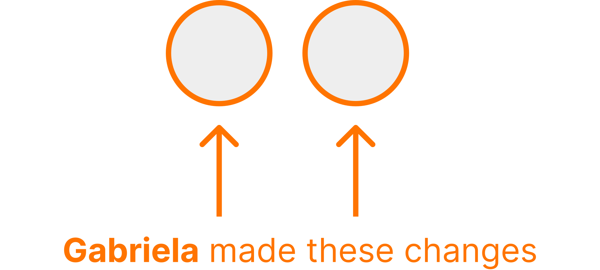

```{r child = "setup.Rmd"}
```

class: dk-section-title, inverse, middle, center

# Using Git and GitHub with R

???

I show things as much as possible within R and not at the command line

---

class: dk-section-title, inverse, middle, center

## What is Git? What is GitHub

---

class: middle

--

.pull-left[

]

--

.pull-right[


]


---

class: middle


???

They're not the same thing

You can use one without the other

TODO: Image of Git vs GitHub

---

### Git

Version control system **on your local computer**

--

Allows you to take **snapshots** of your code as it progresses

--

Allows you to view the **history of your code over time**

---

class: middle

### Git


---

### GitHub


???

Just pan on GH website

---

### GitHub Alternatives


---

### GitHub Alternatives


???

Just pan on GitLab and BitBucket websites


---

class: dk-section-title, inverse, middle, center

## Why Should You Learn to Use Git and GitHub?

---

### Backup

---

class: center, middle


---

class: center, middle


---

### Version control

---

class: center, middle


---

### Collaboration

---

class: center, middle



---

class: center, middle


---

class: center, middle


---

class: center, middle


---

class: dk-section-title, inverse, middle, center

# Setup

---

class: center, middle


---

class: dk-section-title, inverse, middle, center

## Update Everything

???

Update R

Update RStudio

Update all packages (may cause issues, but worth it)

---

class: center, middle

[](https://cran.microsoft.com)

---

class: center, middle

[](https://www.rstudio.com/products/rstudio/download/)

---

class: center, middle


---

class: dk-section-title, center, middle

## Install Git

---


[](http://git-scm.com/downloads)


---

## Configure Git

Let's tell Git who we are!

--


```{r eval = FALSE}
install.packages("usethis") # Only if usethis is not installed
library(usethis)
use_git_config(user.name = "Jane Doe", user.email = "jane@example.org")
```

</div>

???

Explain that you can do lots of things on command line, but I'm showing how not to do so


---

class: dk-section-title, inverse, middle, center

# Using Git

---

## Create a Git Repository

--

```{r}
use_git()
```

---

class: center, middle


---

## Commits

???

Commits are a snapshot of your code at any point

Staging files

Commit messages

---

## Commit History

???

Explain that we make commit message to know what's different at this point

Show just in RStudio

Explain diffs

---


class: dk-section-title, inverse, middle, center

# GitHub

---

## Repositories

One repository for each project

---

## View Commit History on GitHub

???

Same as viewing locally but you can also see code as it was at any point

---

## Create a GitHub Account

???

Show me on the website signing up

---

## Create a Personal Access Token (PAT)

```{r}
create_github_token()
```


---

## Connect RStudio and GitHub

```{r}
# install.packages("gitcreds")
library(gitcreds)
gitcreds_set()
```


---

## Push an RStudio Project to a GitHub Repository

```{r}
use_git()
use_github()
```


---

## Pull a GitHub Repository to an RStudio Project

---

## Push and Pull Between RStudio and GitHub

- Talk about staging, commits again

---


class: dk-section-title, inverse, middle, center

# Collaborating with GitHub

---

## Always Pull Before Pushing

---

## Push Early and Often

---

## GitHub Issues

---

## Branches

---

## Pull Requests


