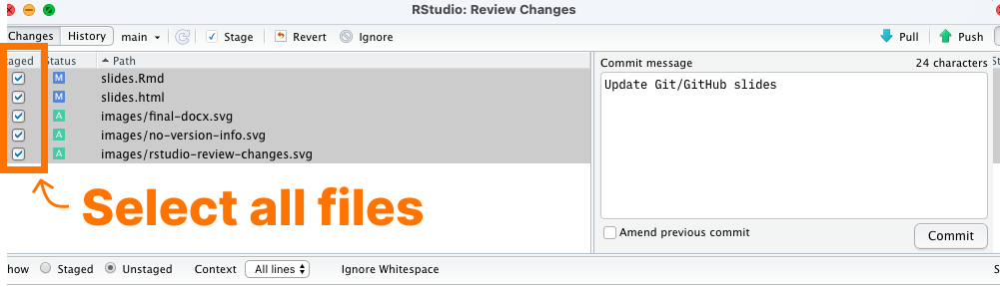
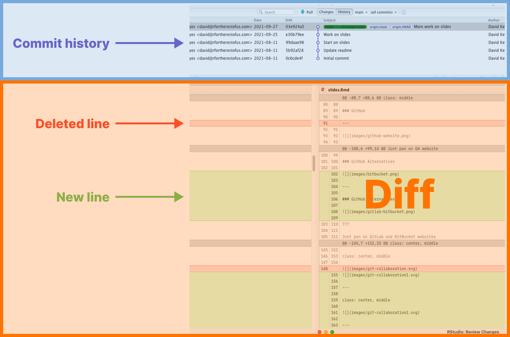
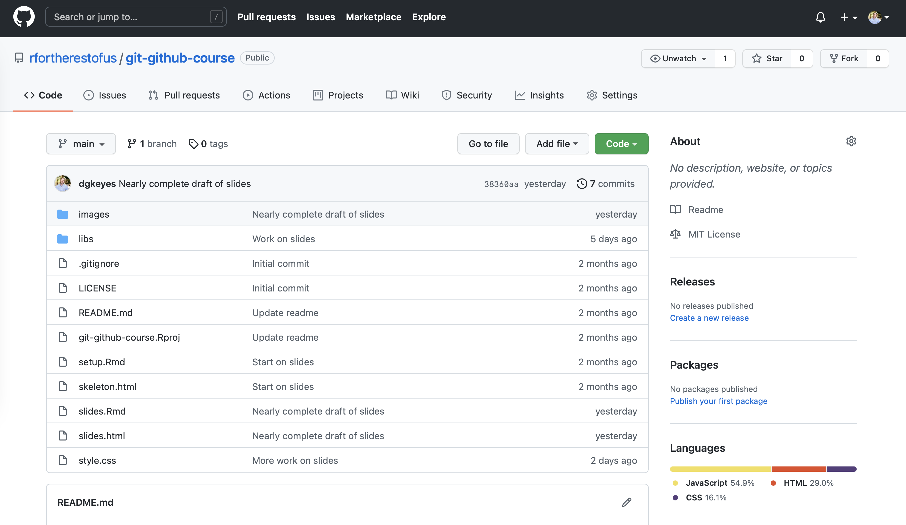
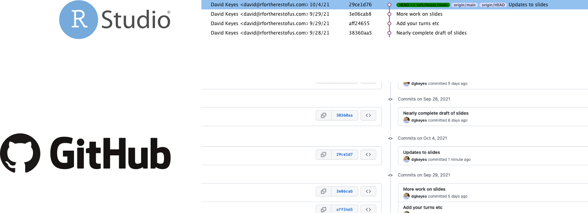
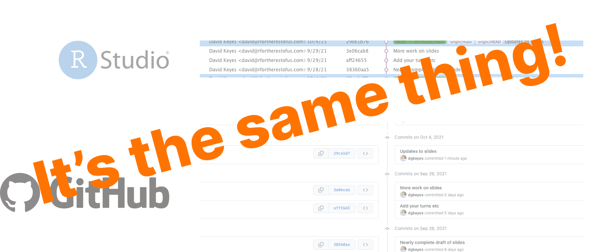
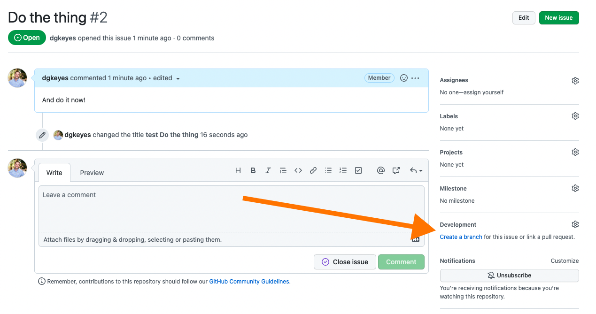

```{r setup, include=FALSE}
knitr::opts_chunk$set(eval = FALSE, 
                      warning = FALSE,
                      message = FALSE,
                      rows.print = 5)
```

class: inverse, middle, center

background-image:url("images/bg-github.jpg")

# Introduction to Git and GitHub

???

I show things as much as possible within R and not at the command line

---

class: inverse, middle, center

background-image:url("images/bg-confused.jpg")

## What is Git?<br>What is GitHub

---

class: middle

--

.pull-left[

]

--

.pull-right[


]


---

class: middle


???

They're not the same thing

You can use one without the other

TODO: Image of Git vs GitHub

---

### Git

--

Version control system **on your local computer**

--

Allows you to take **snapshots** of your code as it progresses

--

Allows you to view the **history of your code over time**


---

class: middle, center


---

### GitHub


???

Just pan on GH website

---

### GitHub Alternatives


---

### GitHub Alternatives


???

Just pan on GitLab and BitBucket websites


---

class: inverse, middle, center

background-image:url("images/bg-workstation.jpg")

## Why Should You Learn to Use Git and GitHub?

---

class: center, middle

### Version Control

--


---

class: center, middle

### Backup

--


---

class: center, middle

### Backup


---

class: center, middle

### Collaboration

--


---

class: center, middle

### Collaboration


---

class: center, middle

### Collaboration


---

class: center, middle

### Collaboration


---

class: inverse, middle, center

background-image:url("images/bg-setup.jpg")

## Update Everything


---

class: center, middle


---

class: center, middle

[](https://cran.microsoft.com)

---

class: center, middle

[](https://www.rstudio.com/products/rstudio/download/)

---

class: center, middle


---

class: inverse

# Your Turn

--

1. Update R

--

1. Update RStudio

--

1. Update all of your R packages


---

class: inverse, middle, center

background-image:url("images/bg-git.jpg")

# Git

---

## Install Git

--

[](https://git-scm.com/downloads)


---

class: inverse

# Your Turn

--

1. Install Git

--

1. Confirm that you installed Git correctly by going to your terminal in RStudio and typing `git --version` (you should have version 2.3 or later)

---

## Configure Git

--

Let's tell Git who we are!

--


```{r eval = FALSE}
install.packages("usethis") # Only if usethis is not installed
library(usethis)
use_git_config(user.name = "Jane Doe", user.email = "jane@example.org")
```


???

Explain that you can do lots of things on command line, but I'm showing how not to do so

---

class: inverse

### Your Turn

--

1. Configure Git by adding a user name and email to your profile

---

## Create a Local Git Repository

--

```{r}
use_git()
```

---

class: center, middle


---

class: inverse

### Your Turn

--

1. Create a new RStudio project called `local-first`

--

1. Add a new Git repository to your project

--

1. Make sure the Git tab shows up in the top right panel

---

## Commits

???

Commits are a snapshot of your code at any point

Staging files

Commit messages

---

## Commits are Snapshots

--


---

## Commits Have Two Parts

--

Part 1: Files you **stage** (i.e. include) 

--

Part 2: A **commit message** that tells you what has changed since the last commit

---

### Staging Files

--

Which files do you want to include in this commit? 

--

Include all files for now

--



---

### Commit Messages

---

class: center, middle


---

class: center, middle


---

class: inverse, middle, center

background-image:url("images/bg-whisper.jpg")

### Commit Messages Tell Us What Changes Were Made

---

class: center, middle


---

class: inverse

### Your Turn

--

1. Create a new file called README.md in your `local-first` project and add text

--

1. Go to the Git tab and hit the commit button

--

1. Check the staged button next to your new README.md file (and any other modified files)

--

1. Add a commit message (e.g. "Add README file")

--

1. Click the commit button

---

class: inverse, middle, center


background-image:url("images/bg-time-travel.jpg")

## Commit History

---



???

Explain that we make commit message to know what's different at this point

Show just in RStudio

Explain diffs


---

class: inverse

### Your Turn

--

1. Add some additional text to your README.md

--

1. Commit your changes (make sure to stage your README.md file and add a commit message)

--

1. View the history of your repository

--

1. Make sure you understand the commit history (top section) and the diff (bottom section)

--

1. View your README.md at a previous commit by clicking on "View file ..."

---


class: inverse, middle, center

background-image:url("images/bg-github.jpg")

# GitHub

---


## GitHub Repositories

--

aka "repo"

--

One repository for each project

---





---


## GitHub Commit History

--


---

class: center, middle

### View Commit History on RStudio or GitHub

<br>



---

class: center, middle

### View Commit History on RStudio or GitHub




???

Same as viewing locally but you can also see code as it was at any point

---

### View Diffs on GitHub

--


---

### View Past Versions of Code

--


---

class: inverse

### Your Turn

--

1. Open the [GitHub repository with the materials for this course](https://github.com/rfortherestofus/git-github-course)

--

1. Click on commits

--

1. Take a look through the commit history to see how the code changed over time


---

class: middle, center, inverse

background-image:url("images/bg-in-sync.jpg")


# Connect RStudio and GitHub


---

class: center, middle


---

### Create a GitHub Account

---


???

Show me on the website signing up

---

### Create a Personal Access Token (PAT)

--

```{r}
library(usethis)
create_github_token()
```


---

### Connect RStudio and GitHub

--

```{r}
install.packages("gitcreds") # Only if gitcreds is not installed
library(gitcreds)
gitcreds_set()
```


---

class: inverse

### Your Turn

--

1. Create a GitHub account

--

1. Create a GitHub personal access token (PAT) using the `create_github_token()` function from the `usethis` package

--

1. Register your PAT using the `gitcreds_set()` function from the `gitcreds` package

---

class: middle, center, inverse

background-image:url("images/handshake.jpg")

## Keeping RStudio and GitHub in Sync

---

## Two Options

<br>

--


--
<br><br>


---

## Push an RStudio Project to a GitHub Repository


---

### Step 1: Initialize a **local** git repository in your RStudio project

```{r}
use_git()
```

---

### Step 2: Connect your local RStudio project to a **remote GitHub repository**

```{r}
use_github()
```


---

class: inverse

### Your Turn

--

1. Open the `local-first` project you created previously

--

1. Push your `local-first` project to GitHub using the `use_github()` function from the `usethis` package

---

## Pull a GitHub Repository to an RStudio Project

<br><br>


---

### Step 1: Create a New Repository on GitHub

---

class: middle, center

[](https://github.com/new)

---

### Step 2: Create a New RStudio Project by Cloning a GitHub Repository

.center[
  
]


---

class: inverse

### Your Turn

--

1. Create a new repository on GitHub called `github-first`

--

1. Create a new project in RStudio by cloning the `github-first` GitHub repository you just created


---

## Keeping RStudio and GitHub in Sync

--

1. Work in RStudio

--

1. Any time you make significant changes, make a commit

--

1. Push your work to GitHub

???

- Talk about staging, commits again

- Finish off by saying you don't need to pull if you're the only one working on the project, but this becomes necessary when you collaborate

---


class: inverse

### Your Turn

--

1. Create a README.md in the `github-first` project and add some text

--

1. Stage this file (and any other modified files) and add a commit message

--

1. Hit commit

--

1. After you commit, push your changes to GitHub

--

1. Go to your GitHub repository and make sure you see your changes

---


class: inverse, middle, center

background-image:url("images/bg-pair-programming.jpg")

# Collaborating with Git and GitHub

---

class: inverse, middle, center

background-image:url("images/kids-pulling.jpg")

## Why Use GitHub vs Dropbox, Google Drive, Box, etc? 

---

## Many People Can Work on the Same Project at Same Time

--


???

People work individually on code

Then push

Then pull and deal with conflicts if they happen


---

class: center, middle

[](https://github.com/rfortherestofus/api-food-asset-map/commits/main)

---

## Combine Code and Communication About Our Code


???

https://github.com/rfortherestofus/api-food-asset-map/commits/main


---

class: center, middle


???

https://github.com/rfortherestofus/api-food-asset-map/issues/69

---

background-image:url("images/rubix-cube.jpg")

class: center, middle, inverse


## There Are Lots of Other Cool Things You Can Do if You Use GitHub

???

Travel back in time

Build websites

GitHub Actions

See and contribute to open source


---

background-image:url("images/hands-in-head.jpg")

class: center, middle, inverse

## Drawback of GitHub:<br>Sometimes Things Go Wrong

---

class: center, middle


???

https://ohshitgit.com + https://dangitgit.com/en

---

class: center, middle


???

https://xkcd.com/1597/
Let's learn how to deal with common problems


---

class: inverse, middle, center

background-image:url("images/pull.jpg")

## Can't Pull Code from GitHub

---

class: center, middle


???

Make example of me working and not being able to pull in changes

Have changes locally that you haven't committed which you need to do before pulling


---

class: inverse, middle, center

background-image:url("images/highway.jpg")

## Merge Conflicts

---

## Merge Conflicts Are Not Unique to Git/GitHub

--


???

With Dropbox, you have to manually copy in pieces you want to keep

---

## Merge Conflicts

When you and someone else edit the same code

--

Git shows you where conflicts are ...

--

But it's up to you to decide which code to keep


---

class: center, middle, inverse

background-image:url("images/panic.jpg")

## Step #1: Don't Panic!


---

## How to Deal With Merge Conflicts


???

> To see the beginning of the merge conflict in your file, search the file for the conflict marker <<<<<<<. When you open the file in your text editor, you'll see the changes from the HEAD or base branch after the line <<<<<<< HEAD. Next, you'll see =======, which divides your changes from the changes in the other branch, followed by >>>>>>> BRANCH-NAME. In this example, one person wrote "open an issue" in the base or HEAD branch and another person wrote "ask your question in IRC" in the compare branch or branch-a.

> https://docs.github.com/en/github/collaborating-with-pull-requests/addressing-merge-conflicts/resolving-a-merge-conflict-using-the-command-line


How do we avoid them? See next steps.

---

## Conflict Markers


---

## Conflict Divider


---

## Code in Your Local Version


---

## Code in Remote Version


---

## Commit of Code in Your Remote Version 


---

## How to Deal With Merge Conflicts

--

1. Decide which pieces of the local/remote code you want to keep

--

1. Remove any code you **don't** want to keep

--

1. Remove the conflict markers and divider

--

1. Commit your code

--

1. Push your code

---

class: inverse, middle, center

background-image:url("images/relax.jpg")

## Relax!


---

class: inverse, middle, center

background-image:url("images/push.jpg")

## Can't Push Code to GitHub

---

### Can't Push Code to GitHub


???

https://happygitwithr.com/push-rejected.html


---

### Can't Push Code to GitHub

--

1. Pull code from GitHub

--

1. Deal with merge conflicts (if there are any)

--

1. Push!


---

class: inverse, middle, center

background-image:url("images/git-best-practices.jpg")

## Let's Keep Bad Things from Happening in the First Place


---

### Always Pull Before Pushing

> Before you try to push code out to the repository, you should always pull all the current changes from the remote repository to your local machine. Doing so will ensure that your local copy is in sync with the remote repository. Remember, other people have been pushing to the remote copy, and if you push before syncing up, you could end up with multiple heads or merge conflicts when you push.

Source: [Nick Hodges](https://betterprogramming.pub/six-rules-for-good-git-hygiene-5006cf9e9e2)


---

### Push Early and Often

--

> If you had pushed D first, you’d be relaxing and they’d be figuring out how to integrate C into their history in order to push. So push your work often. Don’t go dark and work “offline” for long stretches of time.

Source: [Happy Git with R](https://happygitwithr.com/push-rejected.html#she-who-pushes-first-wins)


---

### Commit Regularly

--

> If you feel the need to use the word “and” in your commit message, you are probably not committing often enough.

Source: [Nick Hodges](https://betterprogramming.pub/six-rules-for-good-git-hygiene-5006cf9e9e2)


---

### Use Branches

Let's dive in!


---

class: inverse, middle, center

background-image:url("images/branches.jpg")

# Branches


---

## What are Branches?

--


???

Copy of your code that you can work on while leaving your main branch as is

Start with example of API website: what if I want to make changes but not mess it up

---

## You've Used “Branches”

--


---

class: center, middle

## Git Branches Make Things Much Simpler 

???

Show me working in project and making a v2 version of Rmd file and then switching to Git approach and making a new branch

---


## Why Use Branches?

--

1. You've got a working version in the main branch **you don't want to mess up**

--

1. You can **test something out** and only merge it back into the main branch if it works


---

## Branch Names

--

Historically, the default branch was called **master**

--

Recently, people have recognized **master** is problematic and shifted to using **main** instead

???

Pan on https://sfconservancy.org/news/2020/jun/23/gitbranchname/
https://www.tidyverse.org/blog/2021/10/renaming-default-branch/
https://www.jumpingrivers.com/blog/git-moving-master-to-main/


---

## How to Switch Master to Main in Your Current Project


```{r}
library(usethis)
git_default_branch_rename()
```


---

## How to Use Main in Future Projects


```{r}
library(usethis)
git_default_branch_configure()
```

???

TODO: For learn more, add link to post on how to change all old branches

---

background-image:url("images/create-branch.jpg")

class: inverse, middle, center

## How to Create Branches

---

### Create a New Branch


???

- Show it on RStudio
- Highlight that you can do whatever in branch and it won't affect main
- Show that you can see which branch you're in by looking at git tab
- Make commits on branch (show these commits on GH)

---

### Changes Only Impact the Current Branch

???

- Show how you can alter files and it doesn't change main


---

## How to Merge Back Into the Main Branch

--

You can't do this within RStudio

--

You can merge directly using the command line or a tool like GitHub Desktop

--

But I recommend that you use **pull requests** instead


---

class: center, middle

```{r eval = TRUE, echo = FALSE}
tweetrmd::tweet_embed("https://twitter.com/dgkeyes/status/1450498518993424389",
                      align = "center")
```

???

Show responses and how this changed my thinking


---


## Pull Requests

--

- GitLab calls them [merge requests](https://docs.gitlab.com/ee/user/project/merge_requests/), which is a more descriptive name

--

- They're a way to say, "I've done some thing and I'm ready to merge my code back into the main branch"

--

- Can include multiple commits

---

### How to Create a Pull Request


---

#### How to Create a Pull Request

Find branch you want to use for your pull request and click new pull request


---

#### How to Create a Pull Request

Name your pull request and add any comments


---

### Anatomy of a Pull Request


???

Conversation
Commits
Checks
Files changed
Reviewers


---


### How to Review a Pull Request

1. Open pull request
1. Review it
1. Discuss changes in conversation
1. When ready, merge pull request
1. Delete branch if desired


---

class: center, middle

### How to Close a Pull Request

---

#### No merge conflicts? Merge away!


???

- Delete branch if desired

---

#### Deal with merge conflicts on GitHub

What if you have merge conflict on PR

???

https://docs.github.com/en/github/collaborating-with-pull-requests/addressing-merge-conflicts/resolving-a-merge-conflict-on-github


---

### Use Pull Requests Even When Working Solo


```{r eval = TRUE, echo = FALSE}
tweetrmd::tweet_embed("https://twitter.com/apreshill/status/1363104026460577793",
                      align = "center")
```

???

Transition to talking about project management

---

# Project Management with GitHub

---

## GitHub Issues


---

### Reference Commits and Pull Requests in Issues

If you paste in the URL of a commit, it automatically shortens and links it. 


???

https://github.com/rfortherestofus/api-food-asset-map/issues/9

---

## Other Issue Metadata


???

Assignees

Labels

Projects

Milestones

---

## Linked Branches




???

Show about creating a branch for issue

---

class: inverse, center, middle

# Cool Stuff You Can Do with GitHub

---


## Travel Back in Time

???

https://twitter.com/tw0handt0uch1/status/1481821421676285953?t=fQS4ryKfveDopWSfcKHo8g&s=09

Show how to copy old code history

Show how to revert single file back to previous version

Mention GH Desktop

---

## Publish Your Work Online

???

- Show API food map
- Mention that GH pages exists but I don't like it because it's slow

---

## GitHub Actions

- Use a single example (e.g. update report every night and make new commit, thus pushing it to Netlify)

???

https://orchid00.github.io/actions_sandbox/

