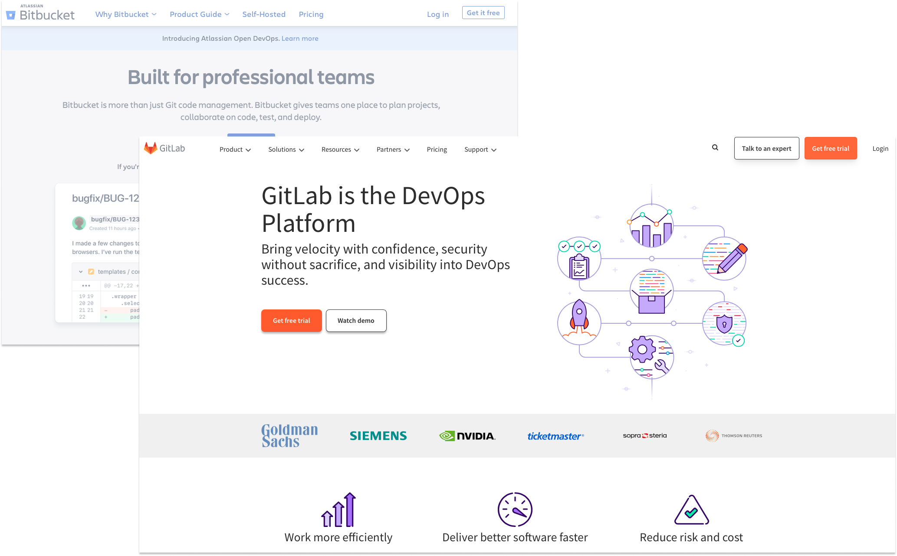
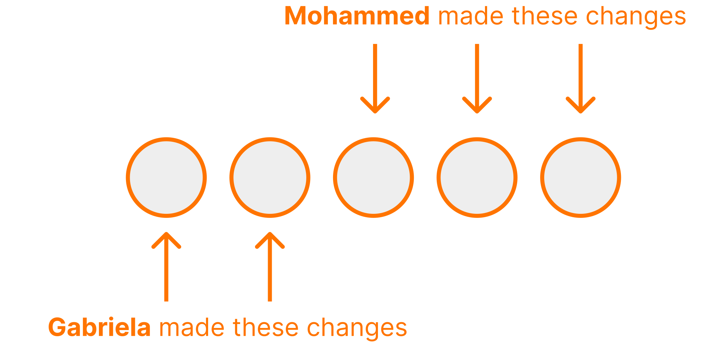
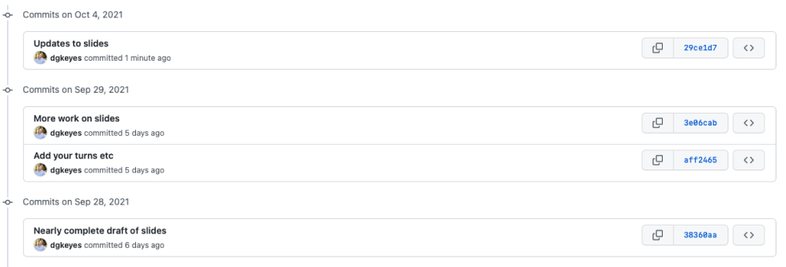

```{r child = "setup.Rmd"}
```

class: dk-section-title, inverse, middle, center

background-image:url("images/bg-github.jpg")

# Using Git and GitHub with R

???

I show things as much as possible within R and not at the command line

---

class: dk-section-title, inverse, middle, center

background-image:url("images/bg-confused.jpg")

## What is Git? What is GitHub

---

class: middle

--

.pull-left[

]

--

.pull-right[


]


---

class: middle


???

They're not the same thing

You can use one without the other

TODO: Image of Git vs GitHub

---

### Git

--

Version control system **on your local computer**

--

Allows you to take **snapshots** of your code as it progresses

--

Allows you to view the **history of your code over time**

---

class: middle, center


---

### GitHub


???

Just pan on GH website

---

### GitHub Alternatives


---

### GitHub Alternatives



???

Just pan on GitLab and BitBucket websites


---

class: dk-section-title, inverse, middle, center

background-image:url("images/bg-workstation.jpg")

## Why Should You Learn to Use Git and GitHub?

---

class: center, middle

### Version Control

--


---

class: center, middle

### Backup

--


---

class: center, middle

### Backup


---

class: center, middle

### Collaboration

--


---

class: center, middle

### Collaboration



---

class: center, middle

### Collaboration


---

class: center, middle

### Collaboration


---

class: dk-section-title, inverse, middle, center

background-image:url("images/bg-setup.jpg")

# Setup

---

class: center, middle


---

class: dk-section-title, inverse, middle, center

background-image:url("images/bg-update.jpg")

## Update Everything

???

Update R

Update RStudio

Update all packages (may cause issues, but worth it)

---

class: center, middle

[](https://cran.microsoft.com)

---

class: center, middle

[](https://www.rstudio.com/products/rstudio/download/)

---

class: center, middle


---

## Install Git

--

[](http://git-scm.com/downloads)


---

## Configure Git

Let's tell Git who we are!

--


```{r eval = FALSE}
install.packages("usethis") # Only if usethis is not installed
library(usethis)
use_git_config(user.name = "Jane Doe", user.email = "jane@example.org")
```


???

Explain that you can do lots of things on command line, but I'm showing how not to do so


---

class: dk-section-title, inverse, middle, center

background-image:url("images/bg-git.jpg")

# Using Git

---

## Create a Local Git Repository

--

```{r}
use_git()
```

---

class: center, middle


---

## Commits

???

Commits are a snapshot of your code at any point

Staging files

Commit messages

---

## Commits Have Two Parts

--

Part 1: Files you "stage" (i.e. include) 

--

Part 2: A commit message that tells you what has changed since the last commit

---

### Staging Files

--

Which files do you want to include in this commit? 

--

Include all files for now

--


---

### Commit Messages

---

class: center, middle


---

class: center, middle


---

class: dk-section-title, inverse, middle, center

background-image:url("images/bg-whisper.jpg")

## Commit Messages Tell Us What Changes Were Made

---

class: center, middle


---

## Commit History


???

Explain that we make commit message to know what's different at this point

Show just in RStudio

Explain diffs

---


class: dk-section-title, inverse, middle, center

background-image:url("images/bg-github.jpg")

# GitHub

---


## Repositories

--

aka "repo"

--

One repository for each project

---

## View Commit History on GitHub

--



---

class: center, middle

### View Commit History on RStudio or GitHub


---

class: center, middle

### View Commit History on RStudio or GitHub


???

Same as viewing locally but you can also see code as it was at any point

---


## Connect RStudio and GitHub

---

class: center, middle


---

## Create a GitHub Account

---


???

Show me on the website signing up

---

## Create a Personal Access Token (PAT)

```{r}
create_github_token()
```


---

## Connect RStudio and GitHub

```{r}
install.packages("gitcreds") # Only if gitcreds is not installed
library(gitcreds)
gitcreds_set()
```

---

## Two Options

<br>

--


--
<br><br>


---

## Push an RStudio Project to a GitHub Repository


---

### Step 1: Initialize a **local** git repository in your RStudio project

```{r}
use_git()
```

---

### Step 2: Connect your local RStudio project to a **remote GitHub repository**

```{r}
use_github()
```

---

## Pull a GitHub Repository to an RStudio Project

<br><br>


---

### Step 1: Create a New Repository on GitHub

---

class: middle, center

[](https://github.com/new)

---

### Step 2: Create a New RStudio Project by Cloning GitHub Repository

.center[
  
]


---

## Keep RStudio and GitHub in Sync

--

1. Work in RStudio

--

1. Any time you make significant changes, stage and commit

--

1. Push your work to GitHub

???

- Talk about staging, commits again

- Finish off by saying you don't need to pull if you're the only one working on the project, but this becomes necessary when you collaborate

---


class: dk-section-title, inverse, middle, center

background-image:url("images/bg-pair-programming.jpg")

# Collaborating with GitHub

---

## Many People Can Work on One Repository

---

class: center, middle


---

class: center, middle

[](https://github.com/rfortherestofus/api-food-asset-map/commits/main)

---

## Merge Conflicts

This is not unique to Git/GitHub

--


---

### Merge Conflicts

When you and a collaborator edit the same code

???

How do we avoid them? See next steps.

---

## Always Pull Before Pushing

---

## Push Early and Often

---

## Dealing with Merge Conflicts

---

# Project Management with GitHub

---

## GitHub Issues

---

### Assign Issues to Individuals

---

### Reference Commits in Issues

---

## Work on Your Code Without Messing Up Things that are Working

---

## Branches

---

## Pull Requests


